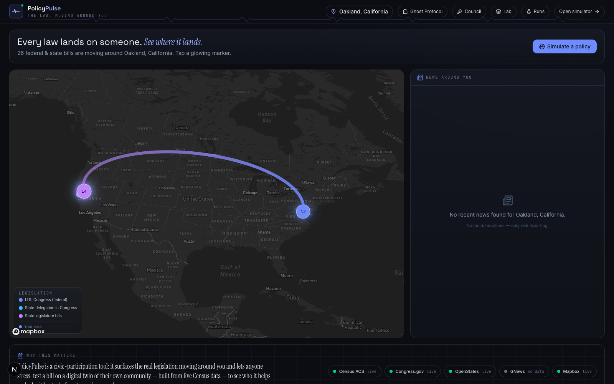
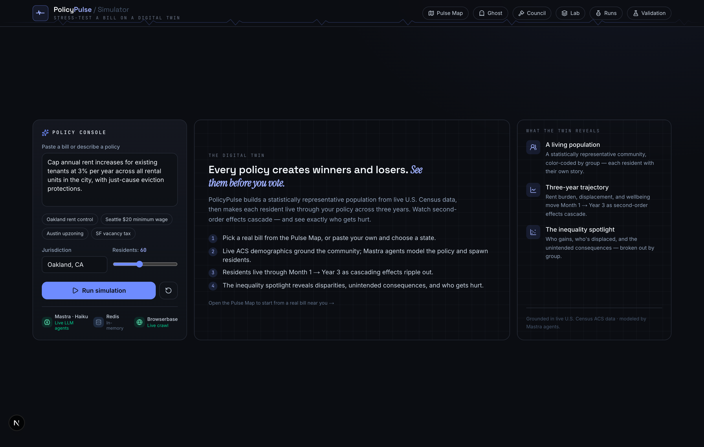
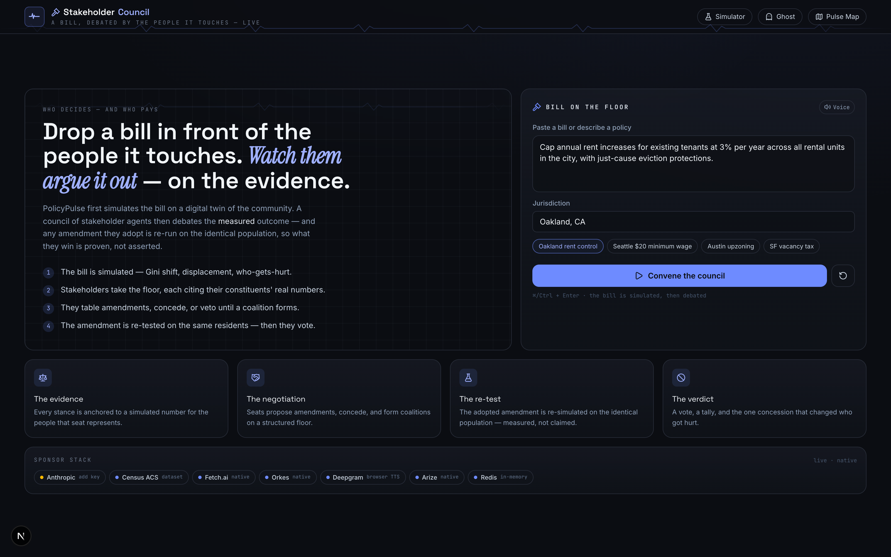
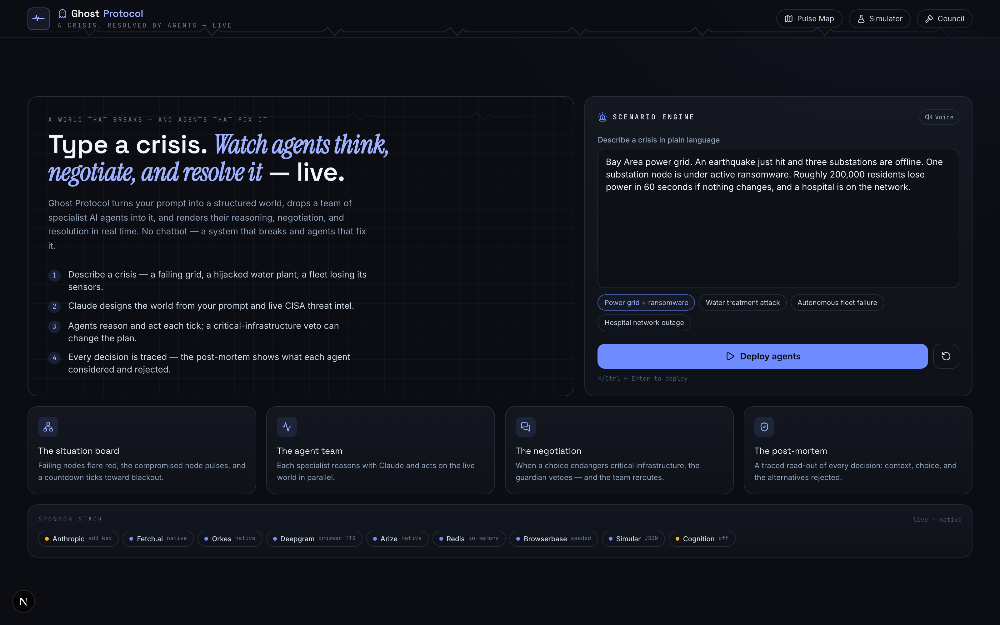
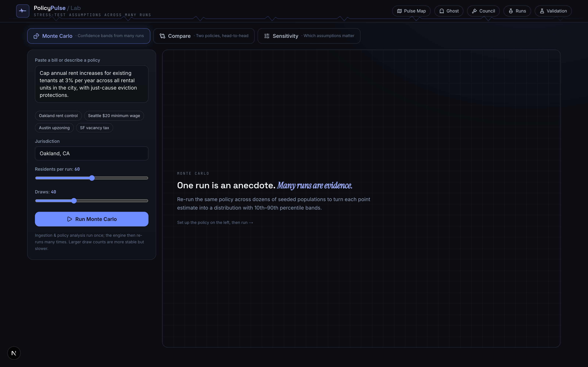
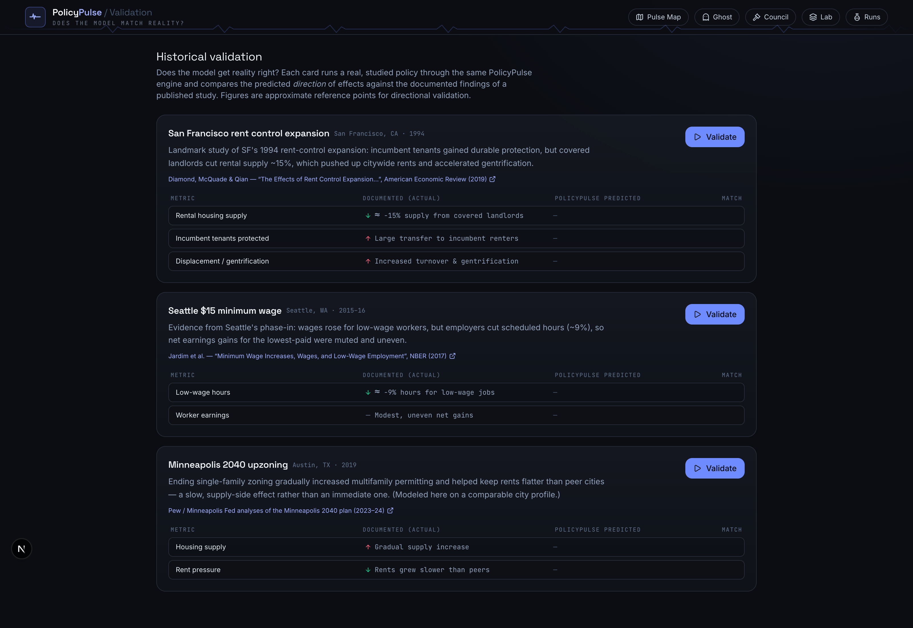
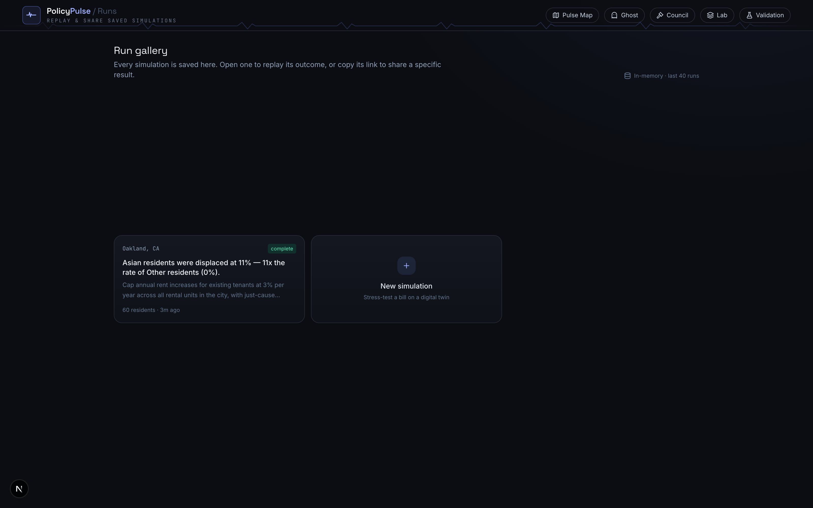

# PolicyPulse — The Complete Project Brief

> **See the law land before it passes.**
> A live civic map of the bills moving around you, paired with a demographic *digital twin* that shows exactly who each policy helps and who it hurts — before anyone votes.

This document is a presentation-ready deep dive into PolicyPulse: the story behind it, every feature, the sponsor stack and *why each one was chosen*, and a full breakdown of the visual identity (theme, fonts, color, motion). Every screenshot is captured from the running app.

---

## Table of contents

1. [The one-liner & the elevator pitch](#1-the-one-liner--the-elevator-pitch)
2. [The story — why this exists](#2-the-story--why-this-exists)
3. [The product at a glance — five surfaces](#3-the-product-at-a-glance--five-surfaces)
4. [Feature deep-dive (with visuals)](#4-feature-deep-dive-with-visuals)
5. [How it works — architecture & data flow](#5-how-it-works--architecture--data-flow)
6. [Sponsor companies & integrations — and why each one](#6-sponsor-companies--integrations--and-why-each-one)
7. [The visual identity — theme, fonts, color, motion](#7-the-visual-identity--theme-fonts-color-motion)
8. [The honesty principle — "no mock data"](#8-the-honesty-principle--no-mock-data)
9. [Tech stack summary](#9-tech-stack-summary)
10. [Suggested slide outline & demo script](#10-suggested-slide-outline--demo-script)
11. [Caveats & pre-demo checklist](#11-caveats--pre-demo-checklist)
12. [Appendix — file map & environment variables](#12-appendix--file-map--environment-variables)

---

## 1. The one-liner & the elevator pitch

**One-liner:** *PolicyPulse turns a real bill into a living, in-browser experiment on a statistically-real model of your own community — so you can see the winners, the losers, and the second-order damage before it becomes law.*

**Elevator pitch (30 seconds):**
> Every law lands on someone. Today we find out who *after* it passes. PolicyPulse flips that: it shows you the real bills moving around you on a live 3D map, then drops any one of them onto a *digital twin* of your community — a population of AI residents built from live U.S. Census data. You watch them live through three years of the policy as second-order effects cascade — a landlord sells, tenants get displaced; a wage floor rises, a small business cuts hours — and an inequality spotlight names exactly who gets hurt. Then a council of AI stakeholders debates the *measured* result and you can stress-test amendments on the same population. It's a flight simulator for public policy.

---

## 2. The story — why this exists

### The problem
Policy is debated in **abstractions** ("this will hurt renters", "this will cost jobs") and decided **before** anyone can see the distributional consequences. The people a bill lands hardest on — low-income renters, immigrant households, small landlords, workers on thin margins — are exactly the people least represented in the room when it's written. By the time the real-world data arrives, the law has already reshaped lives.

### The insight
You can't run a controlled experiment on a real city. But you *can* build a **statistically representative synthetic population** from public demographic data, encode the *well-studied dynamics* of policies like rent control, minimum wage, and zoning into a transparent model, and let the two collide — surfacing **direction and distribution** of effects (who, how much, in what order). Not a forecast; an **intuition engine** for distributional impact.

### The "aha"
Two halves that flow into each other:

1. **The Pulse Map** answers *"what's even happening to me?"* — it makes invisible, jargon-filled legislation **tangible and local**: real bills, plotted around your actual location.
2. **The Simulator (digital twin)** answers *"what would this do to us?"* — it makes abstract policy **visceral**: 60 little residents you can click, each with a name and a first-person story about how the law changed their life.

Then the project pushes further into a research-grade frontier: a **Stakeholder Council** where AI agents argue the bill grounded in the *simulated numbers* (and re-test their amendments on the same people), and **Ghost Protocol**, a live multi-agent crisis cockpit that reuses the same "world that breaks + agents that fix it" engine for critical-infrastructure scenarios.

### Who built it
A small team (GitHub history shows `lukeeskinner` with collaborators `abrham` and `zablon`) shipping fast across feature branches — location/geolocation fixes, "email your representative," resident voice playback, a light/dark theme, the Ghost Protocol cockpit, and homepage performance polish. It has the shape and sponsor breadth of a **multi-track hackathon** entry.

---

## 3. The product at a glance — five surfaces

PolicyPulse is one cohesive product with five navigable surfaces, all sharing the same chrome (the pulse waveform header, the "Civic Instrument" theme):

| Surface | Route | What it answers | One-line |
| --- | --- | --- | --- |
| **Pulse Map** | `/` | "What's moving around me?" | A live 3D map of the real federal & state bills near you + local news. |
| **Simulator** | `/simulate` | "Who does this help and hurt?" | A demographic digital twin lives through the policy across 3 years. |
| **Stakeholder Council** | `/council` | "Who decides, and on what evidence?" | AI stakeholders debate the *measured* outcome and re-test amendments. |
| **Ghost Protocol** | `/ghost` | "Can agents resolve a live crisis?" | A crisis world breaks; a team of agents reasons, negotiates, and resolves it. |
| **The Lab** | `/lab` | "Is one run just an anecdote?" | Monte Carlo, head-to-head compare, and sensitivity analysis. |

Plus two supporting surfaces: **Validation** (`/validate`) checks the model against published studies, and **Runs** (`/runs`) is a shareable gallery of saved simulations.

---

## 4. Feature deep-dive (with visuals)

### 4.1 The Pulse Map — `/` (the homepage)



**What it does**
- **Finds your area** from browser geolocation (or a ZIP / city search), reverse-geocoded with **Mapbox**.
- **Pulls the real bills around you** — live federal legislation from the **Congress.gov** API and state legislation from **OpenStates** — and plots them as glowing markers on a tilted 3D map that flies to your state. In the shot above: **26 bills** moving around Oakland — a purple **state-legislature** cluster over California and a blue **federal** cluster on the East Coast, joined by an arc.
- **Streams local policy news** for your area from **GNews** in an auto-scrolling rail (here showing its *honest empty state* — "No mock headlines — only real reporting" — because GNews returned nothing for Oakland).
- Click a marker → read the bill → **"Simulate this policy"** hands it off to the Simulator pre-loaded with the bill *and* your state.
- A status rail across the bottom shows every live data source and its real state: `Census ACS · live`, `Congress.gov · live`, `OpenStates · live`, `GNews · no data`, `Mapbox · live`.

**Why it matters:** it converts faceless legislation into something you can *see happening around you* — the hook that earns the right to the simulator.

---

### 4.2 The Simulator — `/simulate` (the digital twin)

The idle state frames the thesis and the method:



A full run — *this is the centerpiece of the whole product*:


**The pipeline (left to right, top to bottom in the shot above):**
1. **A bill arrives** (from the map, or you paste your own and pick a state).
2. **Ingestion** grounds the population in **live U.S. Census ACS data** for that state — here California: population **39.4M**, median income **$91,985**, median rent **$1,856/mo**, **44%** renters, plus a real racial breakdown with per-group incomes. The "Ingested sources" list cites the exact ACS tables (B01003, B19013, B25064, B03002, B25003, B19001, DP03).
3. A **Mastra `PolicyAnalyst` agent** parses the free-text bill into a structured **impact model** (mechanism, intensity, who benefits, who pays, likely unintended consequences). Here it classified the bill as `RENT CONTROL` at **62% intensity**. *(With a valid LLM key this is Claude; otherwise it's the transparent heuristic parser — labeled "modeled by heuristic".)*
4. **Proportional spawning** creates 60 individual residents whose joint distribution of race × neighborhood × income × tenure × employment matches the real community.
5. Residents **live through Month 1 → Year 3**. Each round layers market drift, direct policy effects, and **cascading shocks** between agents — streamed live to the **event feed** ("Mateo Flores was priced out and left the city"; "Jin Chen sold/converted a rental → 2 tenants face non-renewal").
6. The **metrics timeline** tracks Avg rent burden, Displaced %, Avg wellbeing, and Housing supply across the three years.
7. The **Inequality Spotlight** is the payoff: *"Asian residents were displaced at 11% — 11× the rate of Other residents (0%)."* It reports the **Gini shift** (0.35 → 0.36, *widened*), a ranked **"who gets hurt"** list (low-income Hispanic renters −17; immigrant households −6) versus **"who benefits"** (low-income white renters +17), and materialized **unintended consequences** (rental supply contracted to 88% of baseline, deferred maintenance, corporate consolidation).
8. Click any resident dot → read their **AI-generated first-person story** (a Mastra `Resident` agent; resident *voice* playback via Deepgram is wired in too).

**Why it matters:** it turns "rent control helps renters" into "*these specific people* were displaced, in *this order*, while *these* benefited, and inequality *widened*" — quantified, color-coded, and clickable.

---

### 4.3 The Stakeholder Council — `/council`

The newest and most novel surface: a bill debated **by the people it touches**, with every stance anchored to a *measured* number.



A live, ratified session (the cockpit captured the full deliberation and verdict):


**The mechanism (genuinely clever):**
1. **The bill is simulated first** on the digital twin — so the council debates *real measured outcomes*, not vibes.
2. A panel is **seated** based on the policy type. Each seat represents a real constituency and is bound to the residents it speaks for:
   - **Tenants Union** (renters & low-income tenants)
   - **Property Owners Assoc.** (small landlords)
   - **Small Business Alliance** (small employers)
   - **Labor Council** (workers & wage-earners)
   - **City Budget Office** (fiscal cost & public services — the pragmatist)
   - **Homeowners Assoc.** (property values & neighborhoods)
   - **Equity Commissioner** (the *chair* — no constituency; speaks for distributional fairness and calls the vote)
3. Each seat states an **opening position** citing *their own constituents'* simulated number (e.g. "*Renters: mean impact +1, 13% displaced — we can support it with changes*").
4. They **table amendments, concede, or veto** until a coalition forms.
5. **The decisive move:** an adopted amendment is **re-simulated on the identical population** — so what they win is *proven, not asserted* — then they cast their final vote.
6. The chair delivers a **verdict** (passed / passed-amended / deadlocked / failed) with a **critical-concession counterfactual** ("*Without it: the unamended bill would have stood*").

**Why it matters:** it models the *politics* of a policy, not just its mechanics — and uniquely grounds AI debate in a re-runnable experiment instead of rhetoric.

---

### 4.4 Ghost Protocol — `/ghost`

A live, multi-agent **crisis cockpit**. The same "a world breaks, agents fix it" idea, applied to critical infrastructure — and the surface that lights up the widest sponsor stack.



The cockpit layout (here mid-bootstrap, *designing the world from the prompt + live threat intel*):


**What it does**
- You **type a crisis** in plain language (e.g. "Bay Area power grid, earthquake hit, three substations offline, one node under active ransomware, ~200k residents lose power in 60s, a hospital is on the network").
- **Claude designs a structured world** — a graph of infrastructure nodes (substations, hospital, water, control, datacenter…) with status, load, capacity, and population served — **grounded in live CISA cybersecurity advisories** scraped via Browserbase.
- A **team of specialist agents** is deployed — **GridAgent, SecurityAgent, CommsAgent, TrafficAgent, MedAgent** — each with a color, a mandate, and Claude as its reasoning engine.
- Every **tick** runs a 9-step workflow (snapshot → fan out → collect proposals → detect conflicts → **negotiate** → resolve → apply → narrate → advance), visualized as an **Orkes**-style orchestration list.
- When an action endangers protected infrastructure, the **guardian agent vetoes** it on a **Fetch.ai**-style structured negotiation bus (propose / veto / counter / consensus) and the team reroutes.
- **Deepgram Aura** narrates the crisis aloud in real time (falls back to browser speech).
- A **post-mortem** traces every decision (**Arize**-style): what each agent saw, chose, *considered*, and *rejected*, with latency and token counts — plus the single **critical decision** and its counterfactual.

**Why it matters:** it's the "wow" demo — a system that visibly *breaks and self-heals* with transparent, traceable agent reasoning. (Note: the live world generation requires a valid Claude key — see [Caveats](#11-caveats--pre-demo-checklist).)

---

### 4.5 The Lab — `/lab`



Three rigor tools that re-run the engine many times:
- **Monte Carlo** — re-run the same policy across dozens of seeded populations to turn each point estimate into a **distribution with 10th–90th percentile bands**.
- **Compare** — pit two policies (or a policy vs. the status quo) on **identical populations** and read off who wins/loses under each.
- **Sensitivity** — sweep a model parameter (intensity, supply elasticity, rent cap, wage target, market rent growth) and **rank which assumptions actually move the outcome**.

**Why it matters:** it pre-empts the "isn't this just made-up numbers?" critique by showing variance, tradeoffs, and which assumptions are load-bearing.

---

### 4.6 Validation — `/validate`



Runs real, **studied** historical policies through the *same* engine and compares the **predicted direction** of effects against the documented findings of published research:
- **SF 1994 rent-control expansion** — Diamond, McQuade & Qian, *American Economic Review* (2019).
- **Seattle $15 minimum wage** — Jardim et al., NBER (2017).
- **Minneapolis 2040 upzoning** — Pew / Minneapolis Fed analyses (2023–24).

**Why it matters:** it's the credibility surface — "does the model get *reality* right?" — with real citations, framed honestly as *directional* validation.

---

### 4.7 Runs — `/runs`



Every simulation is saved and **shareable via a permalink** (runs are deterministic from a seed, so a URL reproduces the exact run). Backed by Redis when configured, in-memory otherwise.

---

## 5. How it works — architecture & data flow

**Framework:** Next.js 16 (App Router, React Server Components, **SSE streaming**), React 19, TypeScript, Tailwind v4 — all running on a single Node runtime.

**The end-to-end flow for a simulation:**

```
Pulse Map (/)                         Simulator (/simulate)
─────────────                         ─────────────────────
geolocate / search                    POST /api/simulate  ──► start a run
   │ Mapbox geocode                          │
   ▼                                          ▼
/api/geo  ──► area + regionCode        orchestrator paces the run
/api/policies (Congress + OpenStates)         │ emits events to the "bus"
/api/news (GNews)                             ▼
/api/census (ACS)                      ingest ─► analyze ─► spawn ─► simulate ─► finalize
   │                                          │  (Mastra agents + engine + cascades)
   ▼                                          ▼
click a bill ──"Simulate"──────────►   GET /api/stream/[runId]  (SSE: backlog replay + live tail)
                                              │   client batches events with requestAnimationFrame
                                              ▼
                                       dashboard renders population, metrics, inequality
                                              │
                                       GET /api/run/[runId]      (full snapshot, shareable)
                                       GET /api/agent/[runId]/[id] (a resident's story)
```

**The "nervous system" (Redis, with an in-memory fallback):**
- **Streams** — the event log (enables backlog replay so a late viewer catches up, then tails live).
- **JSON** — run snapshots (the shareable permalink + runs gallery).
- **TimeSeries** — metric trends over the simulation's rounds.
- **Pub/Sub** — live fan-out to every connected client.

**The AI layer (Mastra):** three agents (`PolicyAnalyst`, `Resident`, `GhostReasoner`), one tool (`ingest-jurisdiction`), and a 2-step `simulation` workflow, all registered on a single Mastra instance. Every agent has a **deterministic, grounded fallback** so a run always completes honestly even with no LLM key (the lone exception is Ghost's world *generation*, which is Claude-only).

**The simulation engine** (`src/lib/engine.ts`, `metrics.ts`, `personas.ts`, `policy.ts`) is a transparent, parameterized model of well-studied policy dynamics — *not* a black box and *not* a forecast.

---

## 6. Sponsor companies & integrations — and why each one

PolicyPulse is built around a deliberate principle: **graceful degradation.** Each integration "lights up one surface," and when a key is missing the app degrades to an **honest empty state or a transparent fallback** — never invented data. Several agent-framework sponsors are implemented in two modes:

- **`live`** — a real, keyed external SDK/API is wired in.
- **`native`** — the load-bearing behavior is implemented *in-app* with an adapter seam ready for the real SDK. This is the **documented hackathon fallback** for Python-only frameworks that can't run inside a Next.js route.

The Ghost and Council dashboards literally render a **"Sponsor stack" rail** showing each integration's live/native status in real time.

### 6.1 Core data & AI (PolicyPulse proper)

| Sponsor / API | Role in the product | **Why this one specifically** |
| --- | --- | --- |
| **Anthropic — Claude** | The reasoning engine for *every* agent: parses bills into impact models, writes residents' first-person stories, powers stakeholder debate, and designs Ghost's crisis worlds. | **Claude Haiku** is fast and cheap enough to run *many* agent calls in parallel under a live, streaming UX (60 residents, multi-agent ticks); Claude's structured-output reliability fits the Zod-validated JSON the app depends on. (The Council path uses Claude Sonnet for higher-stakes synthesis.) |
| **Mastra** | TypeScript-native agent framework: agents, tools, and the simulation workflow, all typed. | It runs **inside Next.js** (no separate Python service), keeping the whole app one deployable. It gives first-class agents/tools/workflows with a model router, so swapping or routing models is trivial. |
| **Redis (Redis Stack)** | The "nervous system": event log, snapshots, metric trends, live fan-out. | Not used as a dumb cache — it uses **Streams + JSON + TimeSeries + Pub/Sub together**, which is an exact fit for an **event-sourced, replayable, live-streamed** simulation with shareable permalinks. |
| **U.S. Census — ACS** | Grounds the synthetic population in *real* demographics (population, income, rent, race, income distribution, tenure, industry mix). | It's the **credibility backbone** — the digital twin is "statistically real" only because it's built from authoritative ACS tables, cited inline in the UI. |
| **Congress.gov API** | Real **federal** bills on the Pulse Map. | The official source of truth for federal legislation — central to the "no mock data" promise. |
| **OpenStates (Plural)** | Real **state-legislature** bills on the Pulse Map. | Most housing/wage/zoning policy actually happens at the **state/local** level; OpenStates covers what Congress.gov can't. |
| **GNews** | Real **local policy news** rail. | Free tier that works in deployed apps; contextualizes the map with what's actually being reported locally (with an honest empty state when there's nothing). |
| **Mapbox (GL JS)** | The tilted 3D US map + **reverse/forward geocoding** ("find my area"). | Best-in-class browser 3D maps and geocoding; the token is restrictable by URL. It's the literal stage the whole homepage is set on. |
| **deck.gl** | GPU-accelerated overlay of glowing bill markers + arcs on the map. | Pairs natively with Mapbox and handles high-performance data-viz layers (markers, arcs, glow) the base map can't. |
| **Browserbase** | Headless browser sessions for **live ingestion** — and in Ghost, scraping **live CISA advisories**. | Lets agents pull *live* web data (threat intel, community data) on demand, grounding scenarios in reality rather than canned text. |

### 6.2 Ghost Protocol's expanded agent stack

Ghost is where the multi-agent sponsor tracks shine. In addition to **Anthropic, Redis, and Browserbase** above:

| Sponsor | Role in Ghost | **Why this one specifically** |
| --- | --- | --- |
| **Fetch.ai** | The **inter-agent negotiation substrate** — structured messages (propose / veto / counter / ack / consensus) on a shared bus. | Multi-agent coordination and negotiation is Fetch.ai's core domain; it's the natural home for the "agents that disagree and reach consensus" mechanic. |
| **Orkes (Conductor)** | **Orchestrates the per-tick workflow** (snapshot → fan-out → collect → detect-conflict → negotiate → resolve → apply → narrate → advance). | Durable, observable workflow orchestration — exactly what a deterministic, replayable tick loop needs. *(Keyed `live` in the current build.)* |
| **Deepgram (Aura)** | **Real-time voice narration** of agent decisions — "mission control." | Aura is low-latency, natural TTS; it turns a dashboard into a *watchable, narrated* event. Degrades to the browser Web Speech API. |
| **Arize (Phoenix)** | **Tracing + eval** for every agent decision — the post-mortem (context, chosen, considered, rejected, latency, tokens). | Purpose-built LLM observability/eval; it backs the "show your work" transparency that makes agent reasoning trustworthy. |
| **Simular (Agent S3)** | Toggles agents between **computer-use (GUI)** and structured-JSON action modes. | A stretch toward general computer-use agents; the seam lets the same agents act via a GUI instead of structured calls. |
| **Cognition** | **Autonomous patch generation** for fixable vulnerabilities (the `patch` action). | Represents autonomous code/remediation generation — closing the loop from "detect" to "fix." *(Armed by default.)* |

> **Talking point:** the `live` vs `native` design isn't a cop-out — it's a *feature*. It guarantees the demo runs end-to-end on any machine, and every sponsor surface has a real adapter seam to flip on with a key. The dashboards prove it by showing each integration's true status live.

---

## 7. The visual identity — theme, fonts, color, motion

The aesthetic has a name in the codebase: the **"Civic Instrument"** palette — *"warm graphite ink + a single ink-blue 'signal'."* The design philosophy is a **dark situation-room / cockpit**: a near-monochrome graphite chrome so that **saturated color always means something** (every vivid hue is reserved for data).

### 7.1 Typography — four typefaces, four jobs

Loaded via `next/font/google` in `layout.tsx`:

| Role | Typeface | Where it's used |
| --- | --- | --- |
| **Display** | **Space Grotesk** (400–700, −0.01em tracking) | Headings, the `PolicyPulse` wordmark, section titles. A techy-but-humanist geometric sans. |
| **Body / UI** | **Inter** | All default interface text and paragraphs. |
| **Editorial serif** | **Instrument Serif** (regular + *italic*) | The signature **italic accent phrases** — *"See where it lands."*, *"See them before you vote."*, *"Watch them argue it out."* Gives a human, op-ed / civic-journalism voice amid the data. |
| **Mono / data** | **JetBrains Mono** (tabular numerals on) | Numbers, readouts, statuses, and the **`eyebrow`** label style (10px, uppercase, 0.2em tracking, muted slate) — the instrument's "record" voice. |

This four-voice system is the backbone of the look: **geometric headline + neutral body + editorial italic + monospaced data.**

### 7.2 Color tokens

**Chrome (near-monochrome, intentionally):**

| Token | Hex | Use |
| --- | --- | --- |
| `--color-ink` | `#0b0d12` | Page background (near-black) |
| `--color-surface` | `#14171f` | Panel base |
| `--color-surface-2` | `#191d27` | Raised panel |
| `--color-line` | `#272c38` | Hairline borders |
| body text | `#dfe3ec` | Default text |
| `--color-signal` | `#6e8bff` | **The single accent** — "ink-blue signal" (buttons, links, focus) |
| `--color-signal-bright` | `#9fb0ff` | Bright accent / hover / italic phrases |

A faint **signal-blue radial wash** glows from the top-right of every page; text selection is signal-blue; focus rings are signal-blue (visible, on-brand accessibility).

**Data colors (deliberately Tailwind defaults — so color = meaning):**

- **Pulse Map legislation:** Federal `#6e8bff` (blue) · State legislature `#c084fc` (purple).
- **Simulation outcomes:** Better off `#34d399` (emerald) · Held steady `#64748b` (slate) · Worse off `#f59e0b` (amber) · **Displaced `#ef4444` (red)**.
- **Demographic groups:** Black `#f59e0b` · Hispanic `#fb7185` · Asian `#22d3ee` · White `#a78bfa` · Other `#34d399`.
- **Ghost node status:** Online `#6e8bff` · Restored `#34d399` · Degraded `#f59e0b` · Offline `#ef4444` · Compromised `#fb7185` · Isolated `#a78bfa`.
- **Ghost agent roles:** GridAgent blue · SecurityAgent rose · CommsAgent emerald · TrafficAgent amber · MedAgent cyan.

### 7.3 Signature elements

- **The PulseMark** — the logo glyph: a single civic **"heartbeat" / ECG waveform** read from the law, drawn as an SVG path inside a rounded, glowing signal-blue square (with an optional live emerald dot). PolicyPulse = *the pulse of policy.*
- **The PulseLine** — an ambient, **horizontally-scrolling pulse waveform** sits under every page header as a "vitals strip," so the whole product literally reads a *live signal*.
- **"glass" instrument panels** — subtle vertical gradient + hairline border + 8px backdrop blur; the primary surface for every card.
- **"grid-bg"** — a faint hairline measurement grid behind idle/stage areas, reinforcing the "instrument" feel.
- **Glow** — `glow-signal` ring used on live/selected elements.

### 7.4 Motion (Framer Motion + CSS keyframes)

Consistent, restrained, and **fully reduced-motion-aware** (every animation is disabled under `prefers-reduced-motion`). Signature easing: `cubic-bezier(0.22, 1, 0.36, 1)`.

- `pp-pop` — residents/markers popping in. `pp-pulse` — live status dots. `pp-scroll-x` — the brand waveform. `pp-vscroll` — the news rail auto-scroll (pauses on hover).
- **Ghost-only ambiance:** `gp-scan` — a scanner beam sweeping the situation board; `gp-flow` — power-flow shimmer along live network edges; `gp-ping` — an attack ping radiating from a compromised node; `gp-breathe` / `gp-flash` — crisis breathing wash + status-change flash. The whole Ghost screen even **reddens while the crisis is live and settles to green once resolved.**

### 7.5 The overall vibe
A **dark, premium "civic situation room."** Monochrome graphite + one electric blue, with saturated color earning its place only on data. Editorial serif italics inject a human, persuasive voice; the recurring ECG waveform ties every surface to the brand. It reads as *instrument*, not *toy* — which is exactly the credibility a policy tool needs.

---

## 8. The honesty principle — "no mock data"

This is a core selling point and worth a dedicated slide. From the project's own README and visible throughout the UI:

- The bills on the map are **real** (Congress.gov / OpenStates). The news is **real** (GNews).
- The population is **directionally real**: with a Census key it's built from **real ACS data**; without one it falls back to *clearly-labeled* approximate datasets (`grounded data` vs `national avg`). Two derived fields (income-tier "neighborhoods" and per-group immigrant share) are transparently labeled as *derived* from the real ACS figures.
- Every live surface degrades to an **honest empty state** ("connect this key" / "no results") rather than ever inventing data — visible in the screenshots as the "GNews · no data" chip and the "No mock headlines — only real reporting" news panel.
- The engine is a **transparent, parameterized model** of studied dynamics — explicitly *not a forecast*, and synthetic residents are *illustrative, not real people*.

> The repeated message: **PolicyPulse builds intuition about distributional effects; it is not a substitute for formal policy analysis.** That intellectual honesty is itself a differentiator.

---

## 9. Tech stack summary

| Layer | Technology |
| --- | --- |
| Framework | **Next.js 16** (App Router, RSC, SSE streaming), **React 19**, **TypeScript**, **Tailwind v4** |
| Agents & orchestration | **Mastra** (agents, tools, workflows) + a direct Anthropic transport for the Council |
| LLM | **Anthropic Claude** — Haiku (fast agents) / Sonnet (Council synthesis) |
| Data layer | **Redis Stack** (Streams / JSON / TimeSeries / Pub-Sub), in-memory fallback |
| Live civic data | **U.S. Census ACS**, **Congress.gov**, **OpenStates**, **GNews**, **Mapbox** |
| Visualization | **Mapbox GL + deck.gl** (3D map), **Recharts** (timelines), **Framer Motion** (motion), **Lucide** (icons) |
| Live web ingestion | **Browserbase** (+ `playwright-core`) |
| Ghost stack | **Fetch.ai**, **Orkes**, **Deepgram**, **Arize**, **Simular**, **Cognition** |
| Validation | **Zod** schemas for all structured LLM output |

---

## 10. Suggested slide outline & demo script

### Slide outline (12 slides)
1. **Title** — "PolicyPulse: See the law land before it passes." (use the Pulse Map screenshot as the cover).
2. **The problem** — policy is decided in abstractions, before anyone sees who it hurts.
3. **The idea** — a live map of real bills + a digital twin of your community.
4. **Surface 1 — Pulse Map** (screenshot `01`).
5. **Surface 2 — The Simulator** (screenshot `04` — let this breathe; it's the hero).
6. **The payoff — the Inequality Spotlight** (crop of `04`'s lower half).
7. **Surface 3 — Stakeholder Council** (screenshot `12`).
8. **Surface 4 — Ghost Protocol** (screenshot `05`).
9. **Surface 5 — The Lab + Validation** (screenshots `08` / `09`).
10. **Architecture** — the event-sourced, streamed pipeline + the Redis nervous system.
11. **Sponsor stack** — the table from §6 + the "live vs native" graceful-degradation story.
12. **Design & honesty** — the "Civic Instrument" theme + "no mock data" principle. Close on the thesis.

### 90-second live demo script
1. Open `/` → "These are *real* bills moving around me right now." Click a marker → **Simulate this policy.**
2. On `/simulate`, narrate the pipeline as it streams: "It's grounding 60 residents in *real* California Census data, then living them through three years…" Point at the cascading event feed.
3. Land on the **Inequality Spotlight**: "Here's the whole point — *Asian residents displaced at 11×* the rate of others, inequality widened, and here's exactly who got hurt." Click a resident → read their story.
4. Jump to `/council` → "Now the people it touches argue the *measured* result — and any amendment gets re-tested on the same population." Show the verdict.
5. Finish on `/ghost` → "Same engine, applied to a live infrastructure crisis — agents reason, negotiate, and resolve it, every decision traced."

---

## 11. Caveats & pre-demo checklist

- **⚠️ The Anthropic API key in `.env.local` is currently invalid** (the live server returns `invalid x-api-key`; the code even warns it may be a *stale exported key shadowing `.env.local`*). Impact:
  - **Simulator, Council, resident stories** still work — they fall back to the transparent heuristic/deterministic engine (this is by design, and looks great).
  - **Ghost Protocol will NOT generate a live world** — its world generation is Claude-only with no fallback (you'll see "Claude could not design a world"). **Fix before demoing Ghost:** set a valid `ANTHROPIC_API_KEY` and ensure no stale `ANTHROPIC_API_KEY` is exported in your shell. *(This is why the Ghost cockpit screenshot shows the "designing the world…" state rather than a populated graph.)*
- **GNews** returned no results for Oakland in the captured run — that's the honest empty state, not a bug. Try a larger metro for a populated news rail.
- **Browser geolocation** only works on a **secure origin** (`http://localhost`, not the LAN IP `next dev` prints). Use the ZIP/city search as the reliable affordance on stage.
- **Mapbox token** in `.env.local` has a leading space — harmless (the env loader trims it) but worth cleaning up.
- The map is **WebGL-heavy**; on a weak projector/VM it can render slowly. Pre-warm `/` before presenting.
- **Secrets:** `.env.local` contains live API keys. Do **not** screenshot or commit that file; rotate keys after the event if the repo is shared.

---

## 12. Appendix — file map & environment variables

### Route & module map
```
src/app/
  page.tsx                 Pulse Map landing
  simulate/page.tsx        The digital-twin simulator
  council/page.tsx         The stakeholder council
  ghost/page.tsx           The crisis cockpit
  lab/page.tsx             Monte Carlo / Compare / Sensitivity
  validate/page.tsx        Historical validation
  runs/page.tsx            Saved-run gallery
  api/                     geo · policies · news · census · simulate ·
                           stream · run · agent · runs · health · validate ·
                           compare · montecarlo · sensitivity ·
                           ghost/* · council/*
src/lib/
  civic.ts usePulse.ts states.ts cache.ts        Pulse Map
  engine.ts metrics.ts personas.ts policy.ts     Simulation engine
  orchestrator.ts bus.ts runStore.ts redis.ts    "Nervous system"
  ingest.ts demographics.ts historical.ts        Data grounding + validation
  sources/                                        census · congress · openstates · news · geocode
  ghost/                                          Ghost engine, agents, integrations, orchestrator
  council/                                        Council brain, stakeholders, orchestrator
src/mastra/
  agents/                  policy-analyst · resident · ghost
  tools/ingest-jurisdiction · workflows/simulation
src/components/            Pulse Map UI · simulator UI · ghost/* · council/* · lab/*
```

### Environment variables (all optional — each lights up one surface)
| Variable | Lights up |
| --- | --- |
| `NEXT_PUBLIC_MAPBOX_TOKEN` | 3D map + geocoding |
| `CENSUS_API_KEY` | ACS-grounded population |
| `CONGRESS_API_KEY` | Real federal bills |
| `OPENSTATES_API_KEY` | Real state bills |
| `GNEWS_API_KEY` | Real local news |
| `ANTHROPIC_API_KEY` | Live Claude agents (required for Ghost world generation) |
| `REDIS_URL` | Redis nervous system (else in-memory) |
| `BROWSERBASE_API_KEY` + `BROWSERBASE_PROJECT_ID` + `ENABLE_BROWSERBASE=1` | Live web ingestion / CISA grounding |
| `DEEPGRAM_API_KEY` | Aura voice narration |
| `ORKES_*`, `FETCHAI_AGENTVERSE_KEY`, `ARIZE_API_KEY` | Flip those Ghost integrations from `native` → `live` |

### About the visuals in this doc
All screenshots in `docs/presentation/assets/` were captured from the app running locally at retina resolution. The capture scripts live in `scripts/shots*.mjs` (Playwright driving Chrome) if you want to re-shoot any surface — e.g. to capture a populated Ghost cockpit once a valid Claude key is set.

| File | Surface |
| --- | --- |
| `01-homepage-pulsemap.png` | Pulse Map (located, real bills) |
| `03-simulator-idle.png` | Simulator idle |
| `04-simulator-run.png` | Simulator full run *(hero)* |
| `05-ghost-idle.png` | Ghost Protocol idle + sponsor stack |
| `06-ghost-cockpit.png` | Ghost cockpit layout |
| `08-lab.png` | The Lab |
| `09-validate.png` | Validation |
| `10-runs.png` | Run gallery |
| `11-council-idle.png` | Council idle |
| `12-council-cockpit.png` | Council live + verdict *(hero)* |
| `13-council-verdict.png` | Council verdict |

---

*Built with Next.js 16 · React 19 · Mastra · Anthropic Claude · Redis · Mapbox + deck.gl · U.S. Census ACS · Congress.gov · OpenStates · GNews · Browserbase · Deepgram · Fetch.ai · Orkes · Arize · Simular · Cognition.*
